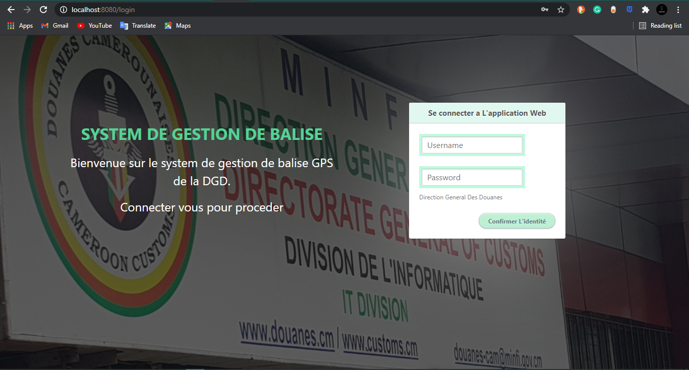

# beacon_management_system

 Management system developed in java with spring Boot
 
 This diagram shows the entities of the system and their relationships: 
 
 
 
This is the login sequence diagram: 

 
 
 The following Use Case diagrams illustrates the interactions of and administrator and a user with the system: 
 
 - Admin Use Case: 

- User Use Case:
 

 
 Here you have the interface of the application: 
 
 
 
 
 
 
